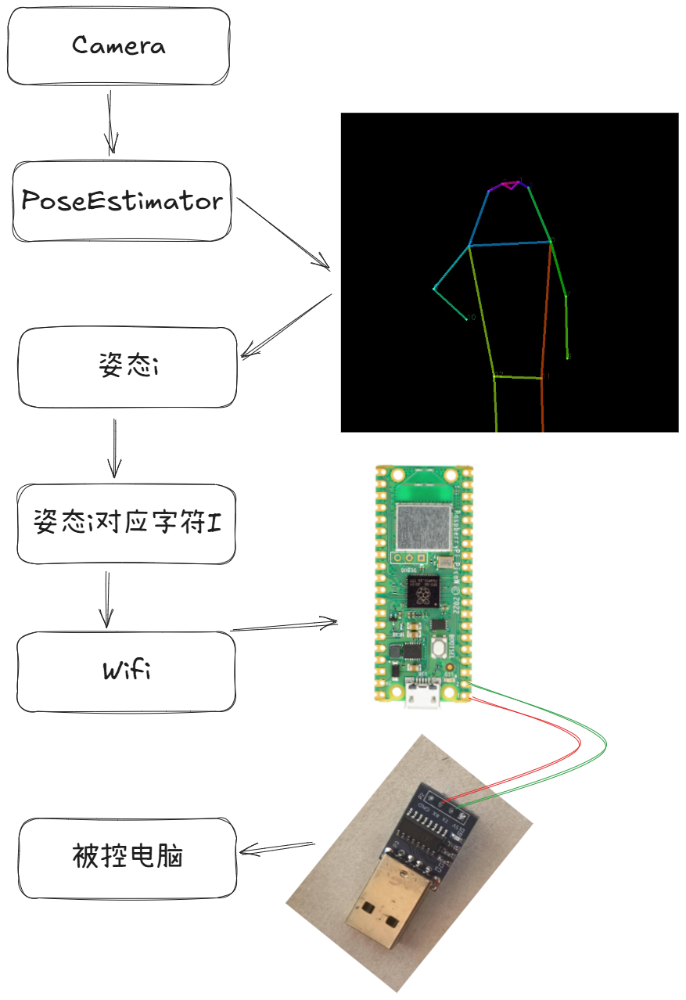
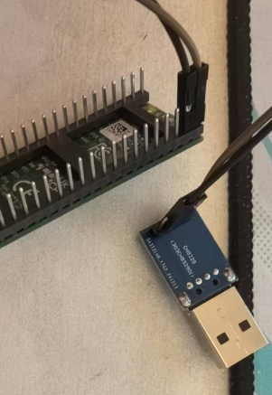
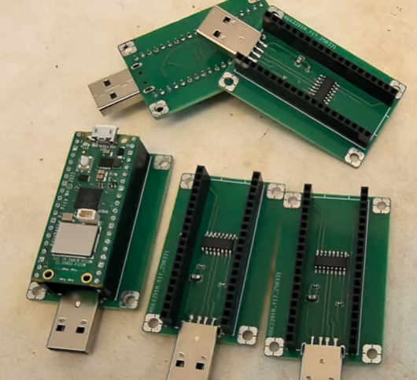

# CameraUSBHid
基于微控制器和姿态检测的体感输入器。

该仓库基于姿态检测获取人物的姿态信息，并通过USB HID协议发送到PC端，替代键盘输入，从而实现体感输入。



> 🎉🎉🎉家人们，我出息了，能在硬件社区公开原理图了 https://oshwhub.com/liyulingyue/camerausbhid

## 开发环境
- 硬件组成
  - 计算中心：带有摄像头和WIFI功能的运算单元，例如 电脑 或 CanMV-K230
  - 微控制器：带有WIFI、UART功能的微控制器，例如树莓派 Pico W/WH 或 ESP32-C3
  - 串口转 HID 键盘鼠标芯片 CH9329
- 开发语言为 Python 和 Micropython
- 成本构成
    - 此处，对构成本套流程的一些必要成本进行描述，实际操作过程中可能会超出预期值，仅供参考。

|          组件           | 最低价格(人民币，元) |                                                                              价格说明                                                                              |
|:---------------------:|:-----------:|:--------------------------------------------------------------------------------------------------------------------------------------------------------------:|
|         运算单元          |     124     | 采用正点原子K230D核心板进行运算，价格为124，核心板需要自行进行电源等封装，该方案暂未进行验证；采用其他K230封装后的开发板，价格约200元；具有 intel 13th i7 CPU 的电脑能够获取 >30fps 的运算速度，价格千元以上。<br/>运算单元可以使用任意摄像头，例如10元左右的USB摄像头。 |
|         微控制器          |     10      |                   采用合宙ESP32C3简约版，价格10元；采用树莓派Pico W 或 Pico WH，价格为52元；采用核桃派pico W，价格为30元，该板卡与树莓派Pico W引脚兼容，并且在Micropython环境下支持蓝牙功能，该方案暂未进行验证。                    |
| 串口转 HID 键盘鼠标芯片 CH9329 |     11      |                                                                      可购买封装好的成品(蓝板)或自行焊接                                                                        |
|          总价           |     145     |                                                                                                                                                                  |


## 开始
本章节对如何基于本仓库构建一个体感输入器进行描述。特别的，由于本仓库的执行和硬件强捆绑，你需要准备对应的硬件设备，请参考以下章节，选择适合自己的硬件方案，并配置相关环境。
- [设备准备](./Docs/设备准备.md)
- [下位机代码配置](./Docs/下位机代码配置.md)
- [上位机代码配置](./Docs/上位机代码配置.md)

### 设备准备

- 电脑(带有摄像头、能够连接到局域网)
- 树莓派Pico W 或 树莓派Pico WH，如需复刻本项目，请确保引脚0和引脚1是可用的
- CH9329 串口转标准 USB HID 设备

### 硬件设备连接
#### 基于杜邦线连接树莓派Pico W 与 CH9329(新手推荐)
首先，你需要将树莓派Pico W 与 CH9329 连接起来，在测试阶段可以采用杜邦线进行连接，这种方式的好处在于不需要自己焊接，购买成品散件即可。但这种方式的缺点在于连线比较散乱，树莓派 Pico W 和 CH9329 不共享供电，因此使用时，还需要额外为 树莓派Pico W 提供电源。

连接方式如下：

|树莓派Pico W引脚| CH9329|
|:---:|:---:|
|GP0 | RXD |
|GP1 | TXD |



#### 基于嘉立创打板连接树莓派Pico W 与 CH9329(进阶推荐)
为了让硬件连接更加紧凑（主要是为了他们能够共享供电），你可以选择在嘉立创打板。(作者比较懒，还没在嘉立创公开项目，如果你对这个项目感兴趣可以催我，让我在嘉立创公开对应的PCB设计文件)

打板后，只需要焊接5个元器件（立创商城可以一键下单）即可：

|     名称     |         型号名         | 数量 |
|:----------:|:-------------------:|:--:|
|   USB公头    | U217-041N-4BV81 | 1  |
| 贴片电容 10uf  | CL21A106KOQNNNE | 1  |
| 贴片电容 0.1uf | CL05B104KO5NNNC | 2  |
|   CH9329   | CH9329 | 1  |



### 硬件设备软件配置
> 如果你第一次使用微控制器，可以参考 https://pico.org.cn/ 中 "如何在 Pico 上使用 MicroPython"，只需要简单3分钟即可快速入门。
- 下载 [Thonny](https://thonny.org/) 并安装，打开 Thonny 并连接到 树莓派Pico W 或 树莓派Pico WH。
- 修改 LowerMachine/RaspberryPicoW.py 文件末尾的 WIFI账号和密码为你的WIFI账号和密码信息。
- 将 LowerMachine/RaspberryPicoW.py 保存到树莓派Pico W 或 树莓派Pico WH 中，保存为 main.py。
- 在 Thonny 中运行 main.py。
- 在 Thonny 中读取输出的 IP 地址，并记录这个地址（后面会用到）。

### 软件设备配置
#### 安装依赖
```bash
pip install -r requirements.txt
```

#### 配置
将 main.pyqt.py 中 server_ip 变量改为你在树莓派Pico W 或 树莓派Pico WH 中输出的 IP 地址。

### 运行与测试
1. 将 main.pyqt.py 中 IF_SEND_COMMAND 改为 False, DEBUG_FLAG 改为 debug，运行 main.pyqt.py, 你将在电脑上看到画面，在画面中做出叉腰、摸头的动作，界面上会显示姿态名称。 
2. 将 main.pyqt.py 中 IF_SEND_COMMAND 改为 True, DEBUG_FLAG 改为 debug，运行 main.pyqt.py, 你将在电脑上看到画面，在画面中做出叉腰、摸头的动作，界面上会显示对应的数字。 
3. 将 下位机硬件 接入被控设备中，打开 记事本，运行 main.pyqt.py, 你将在电脑上看到画面，在画面中做出叉腰、摸头的动作，电脑上的记事本会打印对应的字符。
4. 打开游戏（例如愿神），运行 main.pyqt.py, 游戏角色将会随着你的动作进行移动。

### 动作与配置
当前支持检测的动作可以参考 Source/id.json，每种动作对饮过的姿态可以参考 Source/Images，姿态与键盘输入的对应关系参考 Tools/state2bytes_vector.py。

### 使用K230替代电脑进行检测(未充分验证)
- 修改 LowerMachine/K230.py 文件的 WIFI账号、密码、树莓派Pico的IP 为你的设备信息。
- 将 LowerMachine/K230.py 保存到K230中，保存为 main.py。（Micropython版本）
- 插电后，将摄像头对准人体即可。

## 调试与自定义
你可以通过 debug.gradio.py 配置、记录新的姿势，并生成对应的配置文件 Source/configs.json，之后，仅需要修改 Tools/state2bytes_vector.py 中姿势和键盘输入的对应关系即可。

## 模型来源
更多信息请参考
- https://github.com/openvinotoolkit/open_model_zoo/blob/master/demos/human_pose_estimation_demo/python/README.md
- https://github.com/openvinotoolkit/openvino_notebooks/blob/latest/notebooks/pose-estimation-webcam/pose-estimation.ipynb
- https://storage.openvinotoolkit.org/repositories/open_model_zoo/2022.1/models_bin/3/human-pose-estimation-0001/FP16-INT8/
- https://github.com/PaddlePaddle/PaddleDetection/blob/release/2.5/configs/keypoint/tiny_pose/README.md